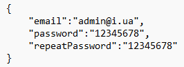
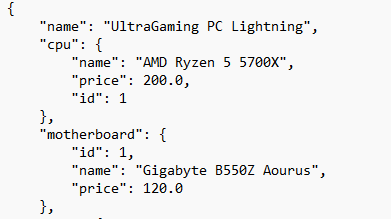
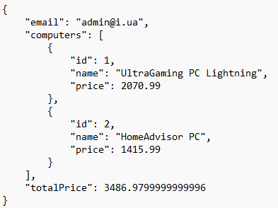
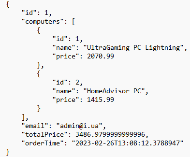

#  Computer-shop
This restful web-app was written using Hibernate, SpringBoot frameworks and relational database MySQL. This app provides: `registration, authorization,
authentication` for user. Each new user is assigned a role
that gives access to specific functionality of app.

#### User can use the following functionality:
- `POST: localhost:8080/register` : This endpoint responsible for user registration and requires some Json data. Here example:

-  `GET: localhost:8080/computers` : This endpoint responsible for show all available computers 
with information about his components and price. Here some examples:

- `PUT: localhost:8080/shopping-carts/computer?computerId=[computerId]` : This endpoint save specific 
computer to shopping cart.
- `GET: localhost:8080/shopping-carts/by-user`: This endpoint show all computers which user add to his shopping cart.
Here some examples:

- `POST:localhost:8080/orders/complete` : This endpoint transfer all products from shopping cart to confirm and save to database the order.
-  `GET: localhost:8080/orders` : This endpoint shows the orders history and time of order.Here some examples:

- 

### Ways of improving this app:
- Add specific functionality to admin role such as CRUD operations to manage our computers and his components;
- Add feature to sell specific components of computer not only computers;
- Add feature of pagination and sorting by computers parameters, such as price etc;
- Add feature of CriteriaQuery to find computer or computer components by they parameters;
- Improving and expanding this app by better unit testing ang bug fixing;

## Structure
#### Project has a three-tier architecture:
- Repository(DAO) layer: works with database.
- Controllers layer: handling requests and responses.
- Service layer: include business logic.

## Used technologies
* Java(19);
* Apache Tomcat;
* Maven, Lombok, Mapstruct;
* MySQL, SQL;
* Hibernate, JPA;
* Spring Core, MVC, Security;
* SpringBoot;
*  SOLID principals, REST;

## Launch
1. Clone or download repository;
2. Create schema named `conputer_shop` in MySQL;
3. Add your database URL, username, password and JDBC driver into corresponding fields in `src/main/resources/application.properties`;
4. Notice that custom data will inject after app build in `src/main/java/com.example.computer_shop/init/DataInitializer`.
5. Run the application.
6. Sign up and try this app by send http request to endpoints from postman.

